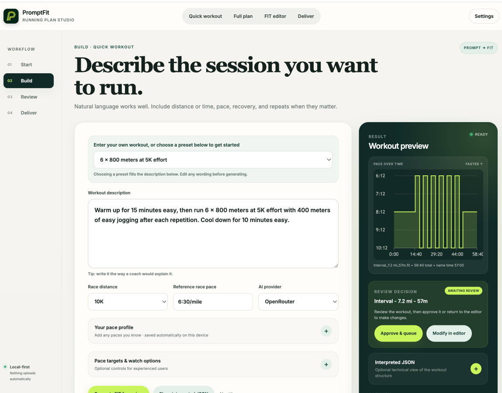
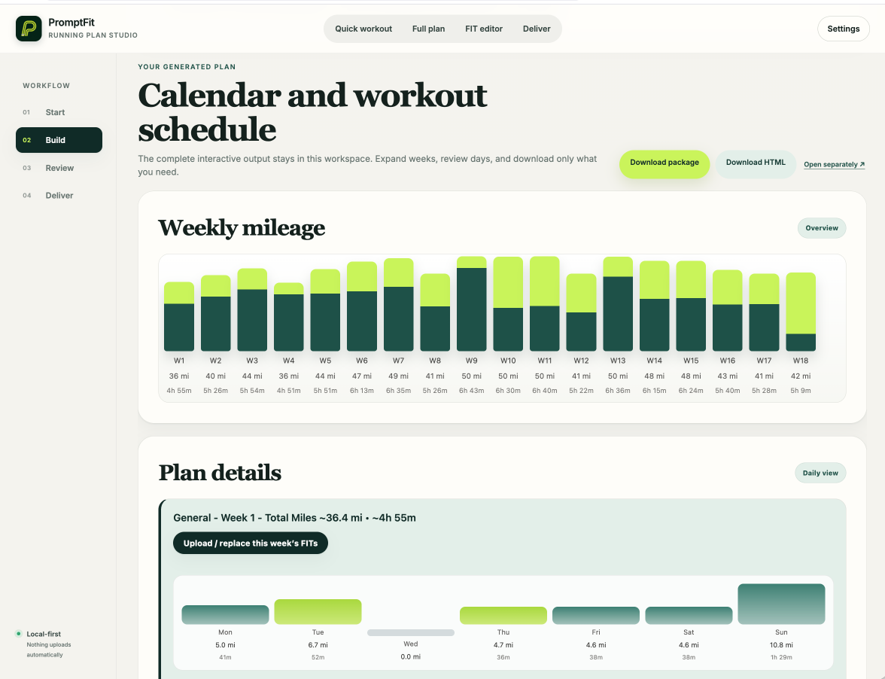
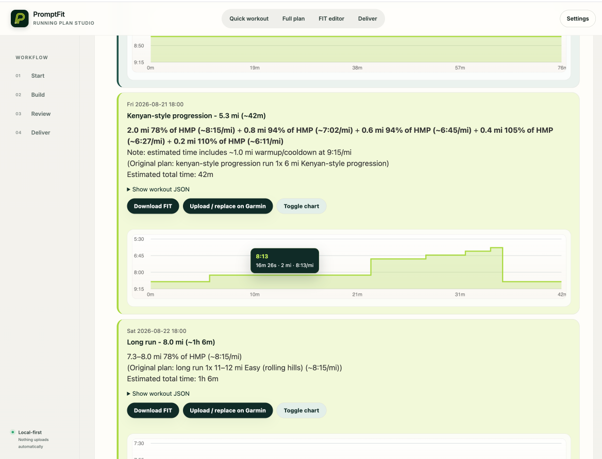

# PromptFit

PromptFit turns written running workouts and full training plans into structured
Garmin FIT workouts, calendars, and readable schedules.

Describe a workout in normal running language, review how PromptFit interpreted
it, adjust the steps if needed, and export it for your watch. PromptFit runs
locally on your computer, and nothing is uploaded to Garmin unless you
explicitly choose to send it.

## See it in action

### Build and review a workout



### Explore a complete training plan



### Review individual workouts before delivery



## What you can do

- Create a structured FIT workout from a written description.
- Build a complete race plan from an included plan or your own plan JSON.
- Export plan workouts, an ICS calendar, and an HTML schedule together.
- Review workouts as a pace graph before using them.
- Open, inspect, edit, reorder, and verify existing FIT workouts.
- Save multiple personal training paces for more consistent targets.
- Interpret common running terms such as easy, threshold, CV, marathon pace,
  Daniels T/I/R pace, Hansons strength, and similar coaching language.
- Optionally upload selected workouts or an entire dated plan to Garmin
  Connect.

The natural-language features require your own OpenAI or OpenRouter API key.
The included plans, manual tools, FIT editor, verifier, and local exports can be
used without an AI key.

## Quick start

PromptFit works on macOS and Windows with Python 3.11 or newer.

### macOS

1. Download and unzip the latest PromptFit release.
2. Double-click `run_webapp.command`.
3. Leave the Terminal window open.
4. Visit [http://localhost:8000](http://localhost:8000).

### Windows

1. Install Python 3.11 or newer from
   [python.org](https://www.python.org/downloads/) and enable **Add Python to
   PATH** during installation.
2. Download and unzip the latest PromptFit release.
3. Double-click `run_webapp_windows.bat`.
4. Leave the command window open.
5. Visit [http://localhost:8000](http://localhost:8000).

The first launch creates a private Python environment and installs the required
packages. This can take a few minutes; later launches are faster.

For Docker and manual installation, see [QUICK_START.md](QUICK_START.md).

## Using PromptFit

The workspace follows four stages:

1. **Start** — choose a single workout, full training plan, or existing FIT
   file.
2. **Build** — write a workout, select a plan, or enter the settings you want.
3. **Review** — inspect the pace graph and workout steps, then make any edits.
4. **Deliver** — download the result, add it to your calendar, sideload it, or
   explicitly send it to Garmin Connect.

### API keys

Open **Settings** in PromptFit and enter an OpenAI or OpenRouter API key for
written-workout and written-plan interpretation. You bring your own key and can
choose the provider and model.

On macOS, PromptFit can save API keys in Keychain. Keys entered in the browser
are otherwise used only for the request you initiate.

### Personal paces

You can save several pace anchors, including easy, marathon, half-marathon,
threshold, 10K, 5K, 3K, and mile/repetition pace. PromptFit uses the most
specific pace you supplied and only estimates a target when an exact anchor is
not available.

The terminology and inference rules are documented in
[PACE_TERMINOLOGY.md](PACE_TERMINOLOGY.md).

## Garmin Connect

Garmin Connect support is optional and uses the community `garminconnect`
integration.

1. Open the **Deliver** section.
2. Connect Garmin once and complete verification if requested.
3. Select the exact workout or plan you want to send.
4. Confirm the upload.
5. Open Garmin Connect and send or sync the workout to your watch.

PromptFit never uploads automatically. Your Garmin password is discarded after
connection; revocable session tokens are stored locally with owner-only
permissions. Disconnecting Garmin removes the saved session.

Garmin Connect uses unofficial private APIs and may stop working if Garmin
changes them. Local FIT creation and download do not depend on Garmin Connect.

## iPhone companion app

The `PromptFitIOS` folder contains an optional native SwiftUI companion app for
people who use Xcode.

It can be installed on a personal iPhone with a regular Apple Account. A paid
Apple Developer Program membership and TestFlight are not required. The iPhone
app connects to PromptFit running on a Mac over the same trusted Wi-Fi network,
so the Mac must remain running while it is in use.

From the iPhone app you can:

- Write or select a workout.
- Review its graph and interpreted structure.
- Approve it before creating the final FIT file.
- Save or share the FIT file.
- Confirm an upload to the Garmin connection stored on the Mac.

To install it, double-click
`PromptFitIOS/Open PromptFit iPhone Project.command` on a Mac with full Xcode
installed, then follow [PromptFitIOS/README.md](PromptFitIOS/README.md).

## Manual installation

If you prefer to start PromptFit from a terminal:

```bash
python3 -m venv .venv
source .venv/bin/activate
python -m pip install -r requirements.txt
./run_webapp.sh
```

Then open [http://localhost:8000](http://localhost:8000).

On Windows, activate the environment with:

```text
.venv\Scripts\Activate.ps1
```

## Docker

```bash
docker build -t promptfit-studio .
docker run --rm -p 8000:8000 promptfit-studio
```

Then visit [http://localhost:8000](http://localhost:8000).

macOS Keychain is not available inside Docker. Enter API keys in PromptFit or
provide them through your own container configuration.

## Project layout

| Path | Purpose |
| --- | --- |
| `webapp/` | Unified local PromptFit web application |
| `Running_Plans/` | Included training-plan JSON files |
| `PromptFitIOS/` | Optional SwiftUI iPhone companion |
| `hm_plan_calendar.py` | Plan scaling and calendar generation |
| `hm_plan_to_garmin.py` | Workout conversion and repeat detection |
| `final_spec_compliant_fix.py` | FIT workout writer |
| `training_plan_gui.py` | Legacy desktop plan interface |
| `ics_to_fit_gui.py` | Legacy ICS-to-FIT utility |

## Privacy and safety

- PromptFit is designed to run locally.
- No workout is uploaded to Garmin without an explicit selection and
  confirmation.
- Review generated workouts and pace targets before training.
- Use phone access only on a private network you trust.
- Do not commit API keys, Garmin credentials, `.env` files, or saved session
  data to a public repository.

## Compatibility

- Python 3.11 or newer is recommended.
- Current versions of Safari, Chrome, Edge, and Firefox are supported.
- FIT behavior can vary between Garmin devices and firmware versions.
- The iPhone companion requires macOS, full Xcode, and a physical iPhone for
  personal installation.

## More information

- [Quick Start](QUICK_START.md)
- [Release Notes](RELEASE_NOTES.md)
- [Pace terminology and inference](PACE_TERMINOLOGY.md)
- [iPhone installation](PromptFitIOS/README.md)

## Disclaimer

PromptFit is an independent project and is not affiliated with or endorsed by
Garmin, OpenAI, OpenRouter, or any training-plan author. Verify every workout
on your device before using it in training.
